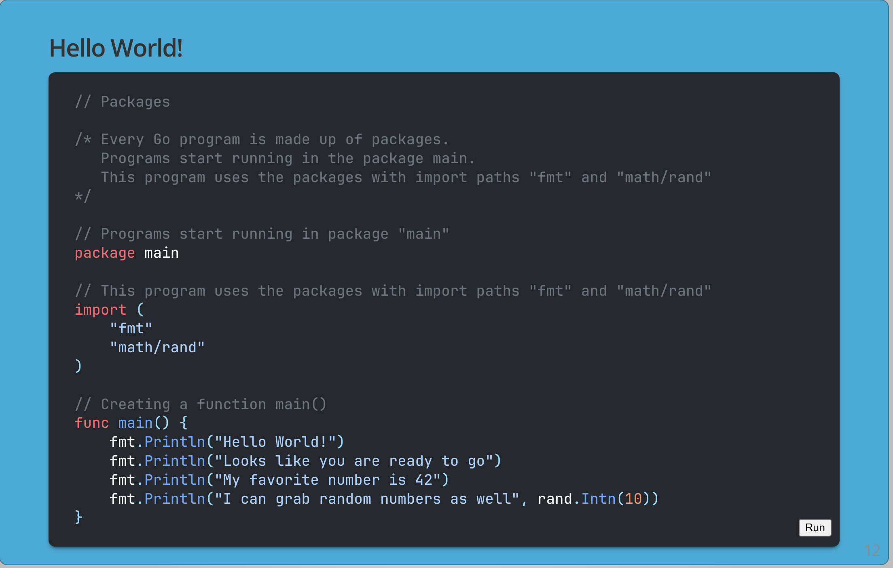

# E&I Dojo Go Presentation: Go Fundamentals



Presentation on the Fundamentals of the Go Programming Language written using the [present tool](https://github.com/golang/tools/tree/master/cmd/present) from Go and syntax highlighting provided by [present-x](https://github.com/soypat/go-presentx).

## Usage

Requires `go-presentx` installed and a prepared directory with `./templates` and `./static` folder. You may clone this repo and run `go-presentx` in the directory to be up and running on [127.0.0.1:3999](http://127.0.0.1:3999/). Go to `slides` link and open a `.slide` file to start a presentation.

This presentation is also hosted: go-talks.appspot.com/github.com/lhogan3/GoPresentation/slides/gopres.slide#1

## Installation

See [releases](https://github.com/soypat/go-presentx/releases) executables for windows/linux/mac binaries.

To install from source: the following commands will generate an executable tool for your OS and architecture. Requires Go

```console
git clone https://github.com/lhogan3/GoPresentation.git
cd go-presentx
go install
```
`go-presentx` shall be installed to your `$GOPATH/bin`. Add this directory to your `PATH` to be able to call `go-presentx` from console.


### Development

* Requires Go installed. Enable modules with `go env -w GO111MODULE="on"`

Start presentation on [127.0.0.1:3999](http://127.0.0.1:3999/) (default) by running:

```console
go run . 
```


## About the syntax highlighting changes
* No auto-rendering while editing

* Uses the lightweight [prism.js](https://prismjs.com/) for syntax highlighting

* Change code style by replacing `static/prism.css` with one from prism.js' site and modifying it to fit your needs (see [css config section](#prism-css-config))

* Press <kbd>CTRL</kbd> while in editable code block to re-render all syntax

* Issue with the caret being invisible at times and sometimes appearing to be on the next line
## Prism CSS config 

* Ligatures off by default. You may enable them in `prism-github-dark.css` by setting `"calt"` to `on` (see comment).

Non-default settings listed:

```css
pre[class*="language-"] {
    caret-color: #ccc;
    font-size: 0.95em;
    border-radius: 7px;
    line-height: 1.2;
}
pre[class*="language-"] {
    padding: 0.6em;
}
```

##  Contributing, License and authors
* Presentation by [Liam Hogan](https://github.com/lhogan3)
* Some examples are from the Go Fundamentals Course hosted by [Alta3 Research](https://alta3.com/)
* [Same license as Go](https://github.com/golang/go/blob/master/LICENSE). Credit to **[The Go Authors.](https://github.com/golang/go/blob/master/AUTHORS)**
